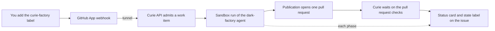

# Dark factory quickstart: a labelled issue becomes a pull request

This guide takes you from nothing to a pull request that Curie's dark factory
opened on a GitHub repository you just created. Everything runs on your laptop:
a local [kind](https://kind.sigs.k8s.io/) cluster, a local image registry, and a
cloudflared quick tunnel so GitHub can reach the cluster.

You label an issue `curie-factory`. Curie reads it, plans, writes a test,
implements, reviews its own diff, opens one pull request, and waits on the
pull request's checks. A live status card on the issue shows each phase.


Budget about 30 minutes for the first pass, most of it waiting on Helm.

## How the loop works



The agent never pushes. It hands Curie a patch, and Curie publishes it from a
separate trusted job with your GitHub App's identity.

## What you need

| Tool | Used for |
|---|---|
| Docker | kind nodes, the local registry, the runner layer build |
| `kind` v0.24 or later, `kubectl`, `helm` | the local cluster. kind's network plugin enforces NetworkPolicy from v0.24, which the sandbox lockdown relies on. |
| `cloudflared` | a public URL for the GitHub webhook |
| `gh` | creating the repository, label and issue (the web UI works too) |
| `curie` v0.11.2 or later | install and deploy ([releases](https://github.com/curie-eng/curie/releases)) |
| An [OpenRouter](https://openrouter.ai/) API key | the factory model, `z-ai/glm-5.3-flash` by default |
| A GitHub account | your own GitHub App and the trial repository |

The guide uses three terminals: one for the commands, one for the tunnel and
one for a port-forward. The commands below use these variables; set them in
the first terminal now:

```bash
export KUBECONFIG="$HOME/.kube/curie-factory"   # a kubeconfig just for this guide
export OWNER=<your-github-login>
export REPO="$OWNER/curie-factory-quickstart"
export CURIE_CREDENTIALS=<openrouter-api-key>    # read by curie cluster up
```

## Step 1: Create the trial repository and the label

```bash
gh repo create "$REPO" --public --add-readme
gh label create curie-factory -R "$REPO" -c 5319E7 \
  -d "Hand this issue to the Curie dark factory"
```

`--add-readme` matters: the factory branches from the default branch, so the
repository needs one commit. It does not need CI. See
[What a repository with no CI sees](#what-a-repository-with-no-ci-sees).

**You should now see** the repository with one `README.md` commit, and a
`curie-factory` label under Issues > Labels.

## Step 2: Create your own GitHub App

There is no shared Curie App to install. Each self hosted Curie needs its own
App, because an App has exactly one webhook URL (yours) and one private key
(which only your cluster may hold). A shared App only works for a hosted
service.

Open **Settings > Developer settings > GitHub Apps > New GitHub App** on your
account (or your organization) and fill in:

| Field | Value |
|---|---|
| GitHub App name | anything unique, for example `curie-factory-<you>`. Its slug is the login the factory answers to. |
| Homepage URL | any URL, for example your repository |
| Webhook | Active. Leave the URL as `https://example.com` for now; Step 5 sets it. |
| Webhook secret | a long random string. Save it: `openssl rand -hex 32 > ~/.curie-factory-webhook-secret` |
| Where can this App be installed | Only on this account |

Repository permissions:

| Permission | Access | Why |
|---|---|---|
| Metadata | Read | Mandatory for every App. Also covers the check that the labelling user has write access. |
| Issues | Read and write | Re-read the issue, keep one status comment, set the `curie-factory:*` state labels. |
| Contents | Read and write | Push the factory's branch. |
| Pull requests | Read and write | Open and update the pull request. |
| Checks | Read | Wait on the pull request's check runs. |
| Commit statuses | Read | Wait on commit statuses. With only one of Checks or Commit statuses, the run ends `ci_unverified`. |
| Actions | Read (optional) | Lets a CI repair round include the failing job's log tail. Without it the repair prompt says `Job log unavailable.` |

Administration is not needed: the labelling user's permission is read with
Metadata alone. This guide's proof run used an App with exactly the first six
rows and no Actions or Administration permission.

Subscribe to these events:

| Event | Why |
|---|---|
| Issues | The label that starts a run, and unlabel or close that cancels it |
| Issue comment | A revision request that mentions the App |
| Pull request review | Review feedback on the factory's pull request |
| Pull request review comment | Inline review feedback |

Create the App, then on its settings page:

1. Note the **App ID** (a number) and the **slug** in the public page URL
   (`https://github.com/apps/<slug>`).
2. Under **Private keys**, generate a key and save the downloaded `.pem`.
3. Under **Install App**, install it on your account and pick
   **Only select repositories** with your trial repository, or
   **All repositories**. This is a click in the web UI; the REST API refuses
   it for a user token.

```bash
export APP_ID=<app-id>
export APP_SLUG=<app-slug>
export APP_PEM=<path-to-downloaded.pem>
```

**You should now see** the App under **Settings > Applications > Installed
GitHub Apps** with access to the trial repository.

## Step 3: Start a kind cluster with a local registry

The factory agent runs on a runner image layer you build in Step 6, and Curie
only deploys a layer by registry digest, so kind needs a registry it can pull
from ([#3619](https://github.com/curie-eng/curie/issues/3619) tracks removing
this wiring).

```bash
cat > kind-curie-factory.yaml <<'EOF'
kind: Cluster
apiVersion: kind.x-k8s.io/v1alpha4
name: curie-factory
containerdConfigPatches:
- |-
  [plugins."io.containerd.grpc.v1.cri".registry]
    config_path = "/etc/containerd/certs.d"
EOF

docker run -d --restart=always -p 127.0.0.1:5001:5000 \
  --name curie-factory-registry registry:2
kind create cluster --config kind-curie-factory.yaml
docker network connect kind curie-factory-registry
docker exec curie-factory-control-plane \
  mkdir -p /etc/containerd/certs.d/localhost:5001
printf '[host."http://curie-factory-registry:5000"]\n' | docker exec -i \
  curie-factory-control-plane cp /dev/stdin \
  /etc/containerd/certs.d/localhost:5001/hosts.toml
```

kind's two CoreDNS replicas hit a conntrack race that stalls name lookups from
new pods for several seconds. In the proof run it made the runner crash at
start and a publication fail with `Could not resolve host: github.com`. One
replica avoids it:

```bash
kubectl -n kube-system scale deploy coredns --replicas=1
```

**You should now see** `kubectl get nodes` list `curie-factory-control-plane`,
and `kubectl -n kube-system get pods -l k8s-app=kube-dns` show one pod.

## Step 4: Open the tunnel

Start the tunnel before the install so its URL can go into the install. Leave
it running in a second terminal:

```bash
cloudflared tunnel --no-autoupdate --url http://127.0.0.1:18000
```

Copy the `https://<words>.trycloudflare.com` URL it prints:

```bash
export TUNNEL_URL=https://<words>.trycloudflare.com
```

A quick tunnel gets a new URL every time it starts, and dies when the laptop
sleeps. `kubectl port-forward` can also drop a request now and then; a
delivery that failed that way can be redelivered from the App's delivery log. If it restarts, repeat Step 5 and the `githubFactoryCardBaseUrl` value
below with the new URL.

## Step 5: Install Curie with factory intake on

Factory intake is off by default and has no CLI flags yet, so it is set with
`--set`. The API refuses to start with intake on unless the App, a
non-default webhook secret, the label, the mention login and a repository
allowlist are all set, so set them in one install. The App's private key goes
into a Secret first, so it never passes through Helm values. Because that
Secret already sits in the `curie` namespace, `cluster up` needs `--adopt` to
take the namespace over.

```bash
kubectl create namespace curie
kubectl -n curie create secret generic curie-github-app \
  --from-file=privateKey="$APP_PEM"

curie cluster up --context kind-curie-factory --adopt --model z-ai/glm-5.3-flash \
  --set api.githubAppId="$APP_ID" \
  --set api.githubAppExistingSecret=curie-github-app \
  --set api.githubFactoryIngressEnabled=true \
  --set api.githubFactoryLabel=curie-factory \
  --set api.githubFactoryMention="$APP_SLUG" \
  --set "api.githubRepoAllowlist[0]=$REPO" \
  --set "api.githubWebhookSecret=$(cat ~/.curie-factory-webhook-secret)" \
  --set "api.githubFactoryCardBaseUrl=$TUNNEL_URL"
```

What each factory value does:

| Value | Meaning |
|---|---|
| `api.githubFactoryIngressEnabled` | Turns factory intake on. |
| `api.githubFactoryLabel` | The admission label. Use `curie-factory`; there is no default. |
| `api.githubFactoryMention` | The App slug a revision comment must mention. |
| `api.githubRepoAllowlist` | Repositories the factory may work on. |
| `api.githubWebhookSecret` | The App's webhook secret, which signs every delivery. |
| `api.githubFactoryCardBaseUrl` | The public origin GitHub fetches the live card image from. Empty shows a text checklist instead. |

The webhook secret passes through the command line here. `cluster up` cannot
read it from a file yet ([#3619](https://github.com/curie-eng/curie/issues/3619)).

On kind the first install stops with `RuntimeClass "gvisor" not found` on
`Job/curie-preflight-gvisor`, after it has already switched gVisor off. Delete
the stale Job and run the same `cluster up` again
([#3618](https://github.com/curie-eng/curie/issues/3618)):

```bash
kubectl -n curie delete job curie-preflight-gvisor
```

**You should now see** `curie is up`, and `kubectl -n curie get pods` with
`curie-api` and `curie-worker` Running.

Check that the sandbox network lockdown is really enforced:

```bash
helm test curie -n curie --kube-context kind-curie-factory
kubectl -n curie logs job/curie-netpol-probe
```

The probe log must contain `enforcement=true`. If it says `enforcement=false`, your kind is older than
v0.24 or uses a network plugin without NetworkPolicy; stop here, because the
sandbox would have open network access.

Now expose the API to the tunnel. Leave this running in a third terminal. A
new terminal does not have the guide's `KUBECONFIG`, so name it:

```bash
kubectl --kubeconfig "$HOME/.kube/curie-factory" --context kind-curie-factory \
  -n curie port-forward svc/curie-api 18000:8000
```

Point the App at it: on the App's settings page set **Webhook URL** to
`$TUNNEL_URL/github/webhook` and save.

**You should now see** `curl -s -o /dev/null -w '%{http_code}\n' "$TUNNEL_URL/health"`
print `200`.

## Step 6: Build and deploy the factory agent

The agent is the [`examples/dark-factory`](../../examples/dark-factory/README.md)
bundle. Fetch it from the release source archive, no clone needed:

```bash
curl -fsSL https://github.com/curie-eng/curie/archive/refs/tags/v0.11.2.tar.gz \
  | tar xz --strip-components=2 curie-0.11.2/examples/dark-factory
```

The bundle builds its runner layer for two architectures, which Docker's
default driver refuses (`Multi-platform build is not supported for the docker
driver`). Build only your kind node's architecture
([#3619](https://github.com/curie-eng/curie/issues/3619)):

```bash
# Use linux/arm64 instead on an Apple silicon Mac. -i.bak works with GNU and BSD sed.
sed -i.bak 's|platforms: \[linux/amd64, linux/arm64\]|platforms: [linux/amd64]|' \
  dark-factory/connectors.yaml
grep platforms dark-factory/connectors.yaml
curie build --plugin-dir dark-factory --registry localhost:5001/curie
```

The bundle needs no GitHub token: the platform reads the issue for it with
your App.

```bash
curie cluster deploy --context kind-curie-factory --plugin-dir dark-factory \
  --agent dark-factory --env prod --repo "$REPO"
```

`cluster deploy` warns `push delivery is NOT armed`. That is about deploying
agents on `git push` and does not affect the factory.

Bind the agent to the repository and set its limits:

```bash
curie cluster surfaces dark-factory --add "github=$REPO"
curie cluster overrides dark-factory --execution-deadline 3600
curie cluster publication-policy dark-factory --policy auto
curie cluster budget dark-factory --limit 5
```

| Setting | Why this value |
|---|---|
| `--execution-deadline 3600` | The default 1800 seconds is tight once CI waits are counted. A small repository needs far less than the 10800 seconds the agent's skill plans for. |
| `--policy auto` | Publish without a human approval of each pull request. Leave it out to approve each one with `curie cluster approvals`. |
| `--limit 5` | A USD cap per day for the agent; a small ticket costs cents. |

The chart's default workspace (1 GiB) and runner resources fit a small new
repository. The 24 GiB workspace in the bundle README is sized for building
Curie itself.

**You should now see** `deployed dark-factory ... -> prod`, and the surfaces
line list `github:<owner>/curie-factory-quickstart`.

## Step 7: Label an issue

```bash
gh issue create -R "$REPO" -t 'Add a hello() function' -b \
'Add a Python module `hello.py` with a function `hello()` that returns the string `"hello"`, plus a unittest test in `test_hello.py` that checks it.

Acceptance criteria:
- `hello.hello()` returns `"hello"`.
- `python -m unittest` passes.'

gh issue edit 1 -R "$REPO" --add-label curie-factory
```

The person who adds the label must have write or admin access to the
repository. Anyone else's label is ignored.

**You should now see**, within a few seconds:

1. In the App's settings, **Advanced > Recent Deliveries**: an `issues`
   delivery with action `labeled` and response `200`.
2. On the issue: a `curie-factory:queued` label, then `curie-factory:running`,
   and one status comment whose card updates at each phase.
3. In the terminal:

   ```bash
   curie cluster work-items --context kind-curie-factory
   ```

   lists the issue as `waiting` (for sandbox capacity), then `running`.

## Step 8: Read the result

The agent works through nine phases: read the issue, pin the criteria, plan,
plan review, a failing test, implement, diff review, publish, and wait for CI.
When it publishes, the issue's status comment links the pull request and the
issue gets `curie-factory:pr-open`.

**You should now see** a pull request on the trial repository opened by your
App (`hello.py` and `test_hello.py`), and a final status comment like this
one from the proof run of this guide, on a repository with no CI:

```text
Completed: https://github.com/<owner>/curie-factory-quickstart/pull/2
Note: No CI checks appeared within 120 s.
Usage: implementer 465,785 tokens (cost unknown), total at least $0.02 (...)

Status: SUCCEEDED
```

In that run the pull request opened about four minutes after the label. A
finished run's work item reads `published`, and its request line in the
detail view reads `completed`.

```bash
curie cluster work-items --context kind-curie-factory <work-item-id>
```

shows the work item with its pull request and live CI state.

## Watch, revise, cancel, retry

| You want to | Do this |
|---|---|
| Watch a run | The status card on the issue, the `curie-factory:*` label, or `curie cluster work-items` |
| Ask for a revision | Comment on the issue and mention the App, for example `@<app-slug> also add a docstring`. A comment without the mention, an edit, or a comment from someone without write access does nothing. |
| Cancel | Remove the `curie-factory` label or close the issue. A pull request already opened stays open. |
| Retry | Remove the label and add it again. The new run gets its own status comment, and the old one says it was replaced. |

The state labels Curie manages, one at a time:

| Label | Meaning |
|---|---|
| `curie-factory:queued` | Admitted, waiting for a sandbox |
| `curie-factory:running` | Running or stopping |
| `curie-factory:pr-open` | Finished with a pull request |
| `curie-factory:needs-human` | Failed or expired; the status comment says why |

A cancelled run removes all four. Curie never changes your `curie-factory`
label.

## What a repository with no CI sees

1. **Checks.** After publishing, Curie waits on the pull request's checks. With
   no checks at all within 120 seconds of the push, and no required check
   configured for the repository, the run completes, and the final status
   comment says `Note: No CI checks appeared within 120 s.`
   A Python change in your repository is judged on your repository's own checks.
   Only a repository listed in `api.githubFactoryPythonCi` has a required check,
   and none is listed by default.
2. **In-sandbox verification.** Before the model starts, the runner runs the
   checks a repository declares in `.curie/verification.json`. With no <!-- doclint:ignore-line -->
   declaration it runs nothing and records `not_declared`, and the agent runs
   the repository's own tests itself where it can. See
   [Repository toolchain in the managed sandbox](repository-toolchain-in-the-managed-sandbox.md)
   to declare checks.
3. **Background builds.** The run ends when the agent's turn ends. A command
   the agent leaves running in the background does not keep the run alive.

## Troubleshooting

| What you see | Cause | Fix |
|---|---|---|
| Delivery log shows `401` | The webhook secret in the App differs from `api.githubWebhookSecret` | Set the same secret in both, then redeliver |
| Delivery log shows `404` or `502` | The App webhook URL is wrong, or the tunnel or port-forward is down or dropped that request. GitHub never retries a failed delivery. | Check `curl $TUNNEL_URL/health`; restart the tunnel or port-forward and update the App URL if needed; then open the failed delivery and click **Redeliver** |
| Delivery is `200` but no work item appears | The labelling user lacks write access, the repository is not in `api.githubRepoAllowlist`, the label name differs, or no agent has the `github=<owner/repo>` surface | Fix the setting and relabel |
| `403` when installing the App on a repository through the API | GitHub refuses that call for a user token | Install it in the web UI (Step 2) |
| `curie-api` crash loops after `cluster up` | Intake is on but a required value is missing | `kubectl -n curie logs deploy/curie-api` names it; set it and rerun `cluster up` |
| `cluster up` fails on `Job/curie-preflight-gvisor` | A stale preflight Job on kind ([#3618](https://github.com/curie-eng/curie/issues/3618)) | `kubectl -n curie delete job curie-preflight-gvisor`, then rerun |
| `curie build` fails with `Multi-platform build is not supported` | Docker's default driver builds one platform | Edit `platforms` in `connectors.yaml` (Step 6) |
| Work item stays `waiting for sandbox capacity` | Another run holds the sandbox, or the runner pod cannot start | `kubectl -n curie get pods`; the run starts when capacity frees |
| Status comment ends with `Could not complete:` | The run stopped; the comment's `Cause:` and `Details:` lines say why | Fix the cause, then relabel |
| Run ends `ci_unverified` | The App cannot read Checks or Commit statuses | Grant both, accept the new permissions on the installation, relabel |
| `Could not complete: the pull request could not be opened.` with `Cause: publication_failed` | The publication Job could not push; `kubectl -n curie logs deploy/curie-worker` shows the git error. On kind, `Could not resolve host: github.com` is the CoreDNS race | Scale CoreDNS to one replica (Step 3), then label a new issue |
| A `curie-thread-*` pod restarts with `verification preflight report was not accepted` or `configured structured history could not be loaded` | Its first start lost a DNS lookup (the CoreDNS race), and later restarts are refused | Scale CoreDNS to one replica (Step 3), remove the label, then label a new issue |
| A label delivery shows `200` but nothing happens for five minutes | The delivery went to another URL (someone else repointed the App), or was lost | Check the App's webhook URL. The reconciler admits a labelled issue whose delivery never arrived after about five minutes |
| `cluster up` refuses: `namespace curie contains non-default objects` | The App key Secret was created first | Add `--adopt` (Step 5) |
| Card shows as a text checklist | `api.githubFactoryCardBaseUrl` is empty or stale | Set it to the current tunnel URL |

## Moving to a real cluster

The factory pieces stay the same. What changes:

1. The registry is one your nodes can pull from, and `curie build` builds every
   platform your nodes run (keep both platforms in `connectors.yaml`).
2. The webhook URL is a stable ingress for the `curie-api` Service instead of a
   tunnel, and `api.githubFactoryCardBaseUrl` is that origin.
3. gVisor stays on where the cluster has the `gvisor` RuntimeClass.
4. A larger repository needs bigger workspace and runner limits, a longer
   execution deadline, and package registry egress for dependency installs.
   The [dark-factory README](../../examples/dark-factory/README.md) has the
   sizing measured on Curie itself, and
   [operations](../operations.md#admitting-a-labelled-github-issue) has every
   intake and CI setting.

## Clean up

```bash
kind delete cluster --name curie-factory
docker rm -f curie-factory-registry
```

Stop the tunnel and port-forward. Delete the App or its webhook URL when you
are done with it.
